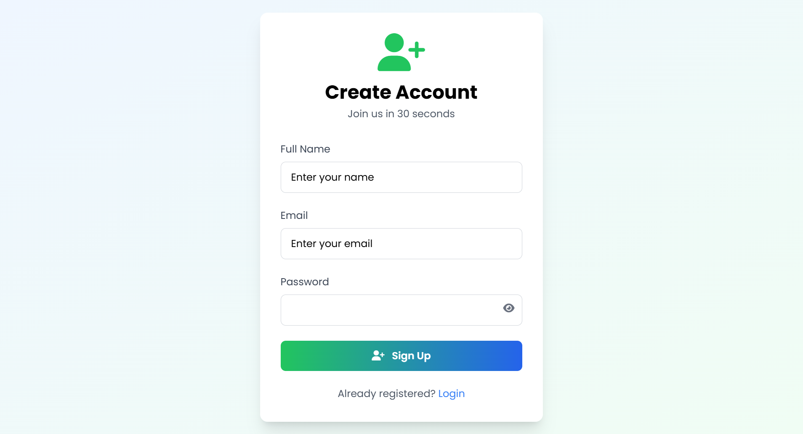
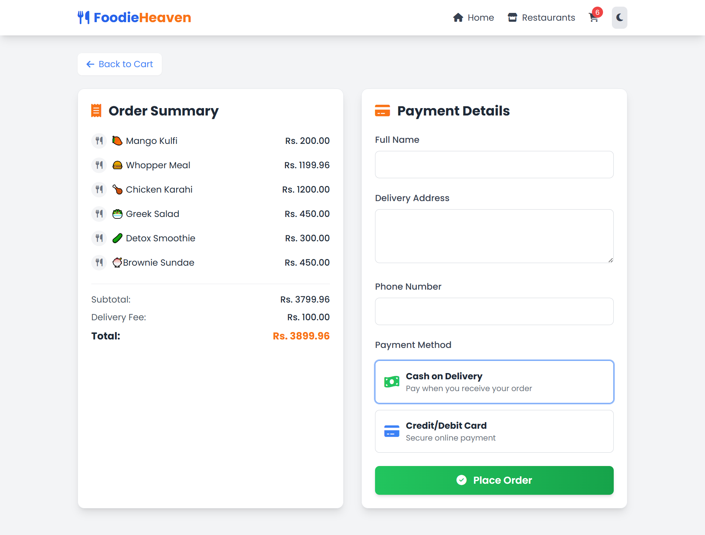
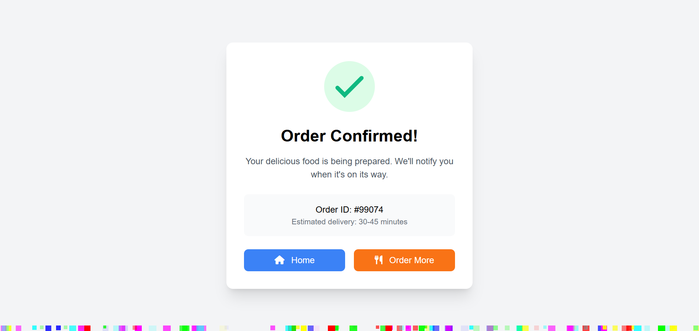

# 🍔 Food Ordering Website  

A complete *Food Ordering Platform* built with *Django (PostgreSQL as database)* for the backend and *HTML, CSS, JavaScript* for the frontend.  

## 🚀 Features  
- User Authentication (Signup/Login)  
- Browse Restaurants & Food Categories (Italian, Chinese, Desi, etc.)  
- Dynamic Menu Management  
- Add to Cart & Checkout Process  
- Order Placement & Confirmation  

## 🛠 Tech Stack  
- *Backend*: Django, PostgreSQL  
- *Frontend*: HTML, CSS, JavaScript  

## ⚙ Setup Instructions  

1. Clone this repository  
   ```bash
   git clone https://github.com/Maha-git55/food-ordering-website.git
   cd food-ordering-website


## 📝 Signup Page 


## 🔑 Login Page 


## 🏠 Home Page 


## ℹ About Page 


## 🍴 Restuarants Page 


##📜  Menu Page 


## 🛒 Cart Page 


## 💳 Checkout Page 


## ✅ Confirmation Page 


## 🍕 Italian Page 


## 🍜 Chinese Page


